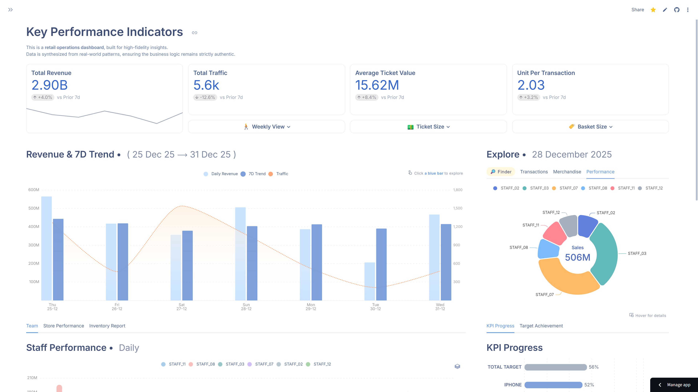
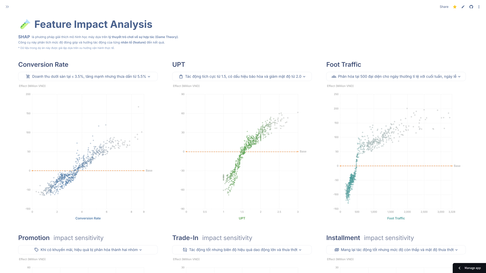

# Dynamic Dataframe: Retail Analytics & ML-Driven Operations Suite


---

## 💡 The Story Behind

<details name="story" open>
<summary><b>English</b></summary>

> **"Orchestrating data streams to decisively solve operational challenges."**
> 
> When static DataFrames were no longer enough to convey insights, I decided to build my own "operating system" using Streamlit and ECharts. I wanted every chart to tell a story and speak directly to operational realities. Every transition within the app was fine-tuned to align perfectly with the management philosophy I have accumulated over time. This is not just a tool—it is the result of personalizing the data experience, transforming raw numbers into direct solutions for operational bottlenecks.
</details>

<details name="story">
<summary><b>Tiếng Việt</b></summary>

> **"Điều phối luồng dữ liệu để giải quyết triệt để các bài toán vận hành."**
> 
> Khi các DataFrame khô khan không còn đủ để truyền tải insight, tôi quyết định tạo ra một 'hệ điều hành' riêng cho mình bằng Streamlit và ECharts. Tôi muốn mỗi biểu đồ phải có một câu chuyện, một tiếng nói phản ánh thực trạng vận hành. Mỗi chuyển động trong app đều được tinh chỉnh để khớp hoàn hảo với tư duy quản trị mà tôi tích lũy được. Đây không chỉ là công cụ, mà là thành quả của việc cá nhân hóa trải nghiệm dữ liệu, biến những con số vô tri thành lời giải trực diện cho bài toán vận hành.
</details>

---

## 📌 Business Case

<details name="business" open>
<summary><b>English</b></summary>

The flaw in legacy management systems lies not in the technology, but in the "siloed barrier" between sales velocity and inventory movement. This disconnect creates blind spots that force operations into a reactive state:

* **Fragmented Data:** Sales records and system inventory files existed as two separate, noise-ridden entities. Instead of manual stitching, I drilled deep into the data structures to let correlations emerge naturally, converting raw data into a unified information plane.
* **Vision Breakdown:** The lack of integration left SKU-level consumption rates obscured. Replenishment decisions were often trapped in guesswork rather than being anchored to actual sales floor performance.
* **Wasted Resources:** Teams buried their hours in reconciliation files instead of optimizing the customer experience.
* **Thirst for Insight:** The core challenge was transforming inert raw files into a deep, high-context data system. I developed a *Demand/Supply* matrix while conducting a deep-dive into 14 critical store operational metrics to instantly clarify: *which SKUs are bottlenecks, where staff performance stands, and which gaps in the product flow need immediate reinforcement.*

**The Solution:**
This system serves as the "operating system" for the retail store. Rather than just visualizing data, it actively surfaces hidden operational correlations, turning bulky data into actionable intelligence. By mastering these correlations, I was able to not only optimize inventory but also re-engineer workflow efficiency—liberating the team from reporting burdens so they could focus on true operational value.
</details>

<details name="business">
<summary><b>Tiếng Việt</b></summary>

Vấn đề của các hệ thống quản lý cũ không nằm ở công nghệ, mà là 'rào cản ngăn cách' giữa dòng chảy bán hàng và luân chuyển kho vận. Sự rời rạc này tạo ra những điểm mù khiến vận hành trở nên bị động:

* **Dữ liệu phân mảnh:** `File bán` và `File tồn hệ thống` tồn tại như hai thực thể tách biệt, đầy rẫy nhiễu. Thay vì ghép nối thủ công, tôi đào sâu vào cấu trúc dữ liệu để các mối tương quan tự lộ diện, chuyển hóa dữ liệu thô thành một mặt phẳng thông tin duy nhất.
* **Đứt gãy tầm nhìn:** Sự thiếu liên kết khiến tốc độ tiêu thụ theo từng SKU trở nên mờ mịt. Quyết định nhập hàng thường bị kẹt trong cảm tính thay vì bám sát thực tế sàn bán.
* **Lãng phí nguồn lực:** Đội ngũ chôn vùi thời gian trong các file đối soát thay vì tối ưu trải nghiệm khách hàng.
* **Khát khao Insight:** Bài toán ở đây là chuyển hóa các file thô vô tri thành hệ thống dữ liệu có chiều sâu. Tôi xây dựng ma trận *Demand/Supply*, đồng thời phân tích sâu 14 chỉ số vận hành store trọng yếu để làm rõ ngay lập tức: *mã hàng nào đang là điểm nghẽn, hiệu suất nhân sự đang ở đâu, và những lỗ hổng nào trong dòng chảy hàng hóa cần được tiếp ứng kịp thời.*

**Giải pháp:**
Hệ thống này đóng vai trò là "hệ điều hành" cho cửa hàng. Thay vì chỉ hiển thị, nó chủ động làm rõ các mối liên hệ ngầm trong vận hành, biến dữ liệu cồng kềnh thành thông tin hành động. Khi đã làm chủ được sự tương quan, tôi không chỉ tối ưu tồn kho mà còn tái thiết lập hiệu quả làm việc, giải phóng team khỏi gánh nặng báo cáo để tập trung vào giá trị vận hành thực thụ.
</details>

---

## 📋 Dashboard


<details name="dashboard" open>
<summary><b>English</b></summary>

### 🔹 Core Functional Modules
* **1. KPI Radar:** 4 core metrics reflecting store "health", integrated with trend Histograms to capture instant fluctuations without opening raw report files.
* **2. Hero Suite & Finder UI:**
    * **Hero View:** A macro overview of daily revenue and 7-day trends, driving real-time data-backed decision-making.
    * **Finder:** A drill-down tool for raw data querying. With a single click on key parameters, I can dive deep into invoice/customer data to uncover root causes.
* **3. Performance & Target Control:**
    * **Store/Team Analytics:** Standardizes data across Daily/Weekly/Monthly timeframes, completely eliminating discrepancies between reporting cycles.
    * **Smart Inventory:** An automated classification pipeline. The system performs dynamic Scoring based on *Velocity* and *Supply*.
* **4. Core Distribution & Product Flow:**
    * **Revenue Treemap:** Deconstructs revenue share by product category. This acts as the analytical gateway, allowing drill-downs to instantly identify "key items" and revenue bottlenecks.
    * **Stock Flow (Interactive):** This module triggers dynamically from category selections within the *Revenue Treemap*. It automatically synchronizes to monitor Inbound - Outbound - Sales - Returns fluctuations, coupled with a cumulative line chart to precisely control product lifecycles.
</details>

<details name="dashboard">
<summary><b>Tiếng Việt</b></summary>

### 🔹 Các Module chức năng chính
* **1. KPI Radar:** 4 chỉ số cốt lõi thể hiện "sức khỏe" cửa hàng, tích hợp Histogram xu hướng để nắm bắt biến động tức thời mà không cần mở file báo cáo.
* **2. Hero Suite & Finder UI:**
    * **Hero View:** Bức tranh toàn cảnh về doanh thu Daily và xu hướng 7 ngày, giúp đưa ra quyết định dựa trên dữ liệu thời gian thực.
    * **Finder:** Công cụ truy vấn dữ liệu gốc (Drill-down). Chỉ với một cú click vào các tham số trọng yếu, tôi có thể lặn sâu vào dữ liệu hóa đơn/khách hàng để tìm nguyên nhân gốc rễ.
* **3. Hiệu suất & Mục tiêu (Performance & Target Control):**
    * **Store/Team Analytics:** Chuẩn hóa dữ liệu theo khung thời gian Daily/Weekly/Monthly, triệt tiêu hoàn toàn sự sai lệch giữa các chu kỳ báo cáo.
    * **Smart Inventory:** Pipeline tự động hóa phân loại. Hệ thống thực hiện Scoring dựa trên *Velocity* và *Supply*.
* **4. Luồng vận động hàng hóa (Core Distribution):**
    * **Revenue Treemap:** Bóc tách tỉ trọng doanh thu theo ngành hàng. Đây là cửa ngõ phân tích, cho phép drill-down để nhận diện ngay lập tức đâu là "key items" và đâu là điểm nghẽn doanh thu.
    * **Stock Flow (Interactive):** Module này được kích hoạt trực tiếp từ hành động chọn ngành hàng trên *Revenue Treemap*. Nó tự động đồng bộ hóa để giám sát biến động Nhập - Xuất - Bán - Trả, kèm đường line lũy kế, giúp tôi kiểm soát chính xác vòng đời của sản phẩm.
</details>

---

## 🧪 Analysis (SHAP)


<details name="shap" open>
<summary><b>English</b></summary>

### 🔹 Feature Impact Analysis (ML-Driven Intelligence)
* **Objective:** Moving past the constraints of static reports, this module leverages Machine Learning (`Random Forest` & `SHAP Theory`) as a "microscope" to isolate and accurately quantify the positive or negative contribution (+/-) of each critical metric on floor revenue. This completely eliminates intuition-based biases from allocation decisions.
* **Management-Focused Technical Solutions:**
    * *Multicollinearity Control:* Strict variable screening was implemented. Seasonality-redundant data was eliminated to isolate the data flow down to 6 core operational/commercial drivers: `Conversion Rate`, `UPT`, `Foot Traffic`, `Promotion`, `Trade-In`, and `Installment`.
    * *Density Mapping:* Integrated density estimation algorithms to disperse data points across ECharts. This allows managers to instantly visualize the operational efficiency's frequency and variance range.
* **Actionable Insights:** The system does not just output numbers; it links directly to action scenarios (via Popover UI) to optimize store performance:
    * Pinpoints conversion rate drop-offs (below the 3.5% threshold) to promptly correct staff-customer engagement workflows.
    * Identifies the saturation ceiling for UPT (at the 2.0 mark) to adjust cross-selling targets realistically, avoiding unproductive pressure on the team.
    * Segmenting traffic scenarios for proactive planning: Drive weekday promotions when foot traffic drops below 500, and shift focus to staff deployment/shelf arrangement when traffic clears the peak threshold of 2,000.
    * Measures the impact margin and decouples the "compounding effect" between Marketing campaigns and financial solutions (Trade-In, Installments), optimizing cost structures and in-store promo budgets.
</details>

<details name="shap">
<summary><b>Tiếng Việt</b></summary>

### 🔹 Feature Impact Analysis (ML-Driven Intelligence)
* **Mục tiêu:** Vượt qua giới hạn của các báo cáo tĩnh, module này sử dụng Học máy (`Random Forest` & `SHAP Theory`) như một "kính hiển vi" để bóc tách và định lượng chính xác mức độ đóng góp (+/-) của từng chỉ số trọng yếu lên doanh thu sàn. Từ đó, loại bỏ hoàn toàn cảm tính khi đưa ra quyết định điều phối.
* **Giải pháp kỹ thuật phục vụ quản trị:**
    * *Kiểm soát cộng tuyến (Multicollinearity):* Áp dụng nghiêm ngập việc sàng lọc biến. Loại bỏ các dữ liệu trùng lặp về mùa vụ để cô lập dòng chảy vào đúng 6 động lực vận hành/thương mại cốt lõi: `Conversion Rate`, `UPT`, `Foot Traffic`, `Promotion`, `Trade-In`, và `Installment`.
    * *Trực quan hóa mật độ (Density Mapping):* Tích hợp thuật toán ước lượng mật độ để phân rã các điểm dữ liệu trên ECharts. Giúp người quản lý nhìn thấy ngay tần suất xuất hiện và khoảng dao động của hiệu quả vận hành.
* **Giá trị thực chiến (Actionable Insights):** Hệ thống không chỉ đưa ra con số mà kết nối thẳng tới các kịch bản hành động (Popover UI) để tối ưu hóa hiệu suất Store:
    * Định vị "điểm gãy" của tỷ lệ chuyển đổi (dưới mốc 3.5%) để kịp thời chấn chỉnh quy trình tiếp cận khách hàng của nhân sự.
    * Nhận diện "ngưỡng trần bão hòa" của UPT (mốc 2.0) để điều chỉnh mục tiêu doanh số bán kèm (Cross-selling) thực tế hơn, tránh gây áp lực vô ích lên đội ngũ.
    * Phân hóa kịch bản Traffic để chủ động lập kế hoạch: Đẩy ưu đãi ngày thường khi khách dưới ngưỡng 500, và chuyển trọng tâm sang điều phối nhân sự/bố trí quầy kệ khi khách vượt ngưỡng cao điểm 2,000.
    * Đo lường biên độ ảnh hưởng và bóc tách hiện tượng "gộp hiệu năng" giữa các chương trình Marketing với giải pháp tài chính (Trade-In, Trả góp), tối ưu hóa cấu trúc chi phí và ngân sách ưu đãi tại store.
</details>

---
## 📂 Project Structure
```
.
├── .devcontainer/
│   └── devcontainer.json
├── .streamlit/
│   └── config.toml
├── core/
│   ├── anonymize_sales_product.py
│   ├── finalize_and_clean_dataset.py
│   ├── load_normalize.py
│   ├── mimic_financial_logic.py
│   ├── pipe_run.py
│   ├── process_product_master.py
│   ├── run_auth_pipe.py
│   ├── sales_join_traffics.py
│   ├── secure_customer_identity.py
│   ├── secure_product_identity.py
│   └── validate_standardize.py
├── sections/
│   └── dashboard/
│       ├── get_data.py
│       ├── hero_n_finder.py
│       ├── high_level_df.py
│       ├── kpis_4_metrics.py
│       ├── target_n_pfm.py
│       └── tree_n_movement.py
├── src/
│   ├── columns.py
│   ├── customer_logic.py
│   ├── datetime_logic.py
│   ├── product_logic.py
│   ├── revenue_logic.py
│   ├── stage_n_execute_logic.py
│   ├── stockledger.py
│   └── utils.py
├── views/
│   ├── dashboard.py
│   ├── demo.py
│   ├── shap_analysis.py
│   └── test.py
├── visuals/
│   ├── css_inject.py
│   ├── dynamic_dataframe.py
│   ├── e_charts.py
│   ├── visuals_helper.py
│   └── web_ui.py
├── .gitignore
├── app.py
├── README.md
└── requirements.txt
```

## 🛠️ Requirements

```text
duckdb==1.5.4
google_api_python_client==2.197.0
joblib==1.5.3
numpy==2.5.0
pandas==3.0.3
protobuf==7.35.1
python-dotenv==1.2.2
scikit_learn==1.9.0
scipy==1.18.0
shap==0.52.0
statsmodels==0.14.6
streamlit==1.56.0
streamlit_echarts==0.6.0

